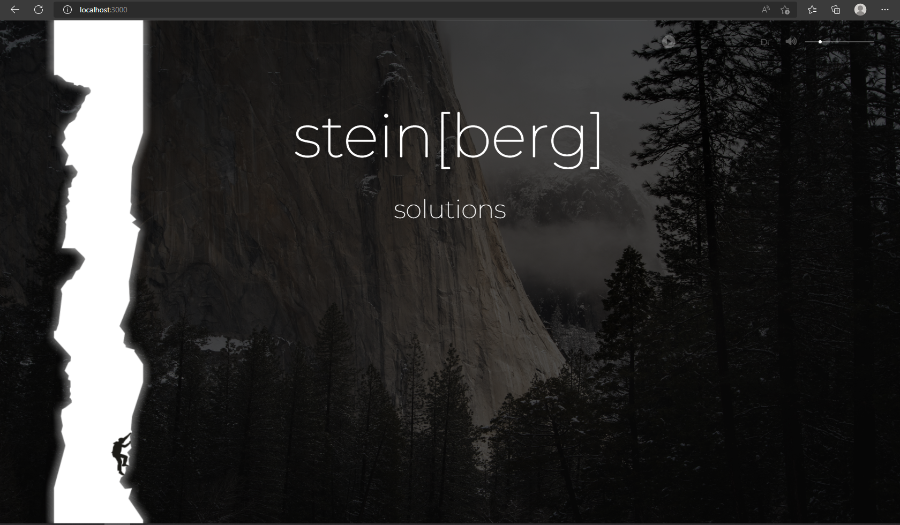
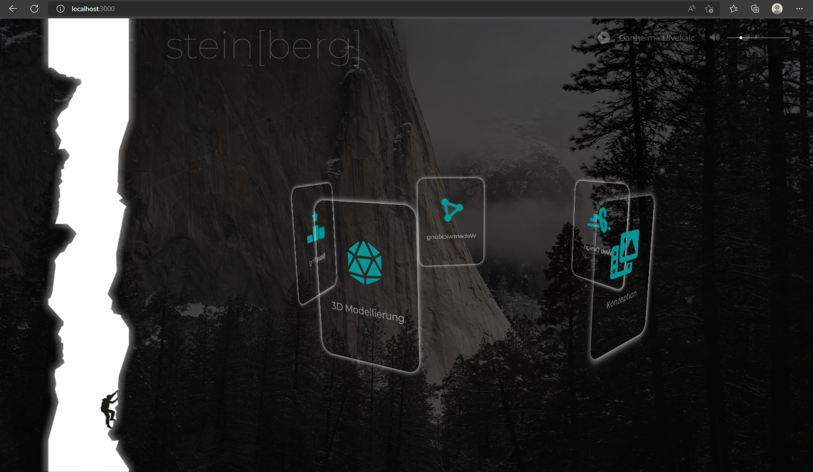
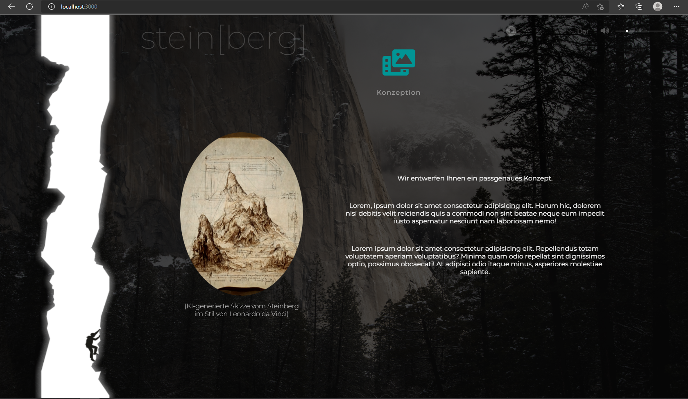

# steinberg

A project to get in touch with sass and to try out some new techniques like draggable caroussel slider and animations via sprite sheet. The website is not responsive yet and definitely not finished. Looking forward to change these points.

The website starts with a opener which asks the visitor if he/she would like to visit the website with background music. In the first concept were moving clouds in the background with a darker atmosphere. While I was working out different concepts I was listening to Danheim. I realized, that it fits very well to the whole szenery so I decided to implement the music. In case I want to publish the website I have asked the Artist behind Danheim if I may use his music on my website. He agreed. So shoutout to Danheim and many thanks! (even if it won't be the case here)

After deciding, if music or not, the visitor comes to the main section. As you can see there are no moving clouds. That's because I changed the whole concept to a concept I had more fun working on. The music player is on the right upper side. I let it there. The volume slider and the buttons are fully working. The volume-button also change by volume-change.

On the left side is a szenery witch a climber inside a rock crevice. Here I want to use sprite sheet to get different animations. The scenery will work as a loading animation. Also the climber will get different hover-animations. Thats whats taking time (because I need a lot of different frames to get a smooth animation) and what will come later.

The company name in the middle will disappear and a dragable caroussel slider will appear.

The slider is not really a slider as usual. It's more like an overview of the different areas the visitor can go to. The cards with the areas are rotating in a circle. By mousedown, mousemoving and mouseup the caroussel can increase/decrease the speed, change angle or direction of movement. By clicking, all cards (except the one what was clicked) go to a fixed position in the center and disappear. The choosen card change appearance and moves to the top and works as a title. By hovering the card will get the old appearence to signalize, that it's clickable. By clicking, the other cards will appear again and the choosen card goes back in line with the other cards while rotating.

Here you can see the area the visitor will reach by clicking one card. This is just a placeholder while I am working out different concepts. (may be interesting: the picture you can see there was generated by midjourney AI -> https://www.midjourney.com/home/ )

The idea was, to create a website for a web-design company. The scenery and atmosphere as well as a lot of other points are not really fitting to this topic. I did it nevertheless like this because I wanted to try out some new things and it was just fun to create it like this. But I must admit, that it would fit better to a mountaineering accessories shop or something like that.
